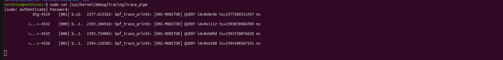
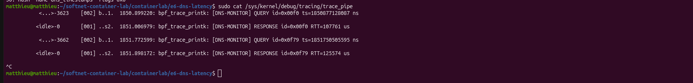

# E6 — DNS Response Latency Monitor (eBPF)

**Student:** Comparetto Matthieu — matricola 0383422
**Course:** Software Networks 2025-26 — Tor Vergata
**Level completed:** Basic + Intermediate level

---

## What this project does

Every time your computer visits a website, it first sends a DNS query to ask "what is the IP address of this domain?". The DNS server replies, and only then the connection begins. This round-trip takes a few milliseconds — sometimes more if the network is slow or the server is overloaded.

This project uses eBPF to intercept those DNS packets directly inside the Linux kernel, timestamp them, and compute how long each query takes to get a response. The measurement happens at the kernel level (TC hook), which is far more precise than application-level tools like `dig`.

---

## Architecture

```
Container client (10.0.0.1)
        │
        │  eth0 ──► internet (8.8.8.8)
        │  eth1 ──► dns-server container (10.0.0.2)
        │
   [TC egress hook]  ← our eBPF program intercepts outgoing DNS queries
   [TC ingress hook] ← our eBPF program intercepts incoming DNS responses
        │
        ▼
   BPF HashMap { txn_id → timestamp }
        │
        ▼
   RTT = response_timestamp - query_timestamp
        │
        ▼
   /sys/kernel/debug/tracing/trace_pipe  ← readable from host
```

The lab runs two containers connected via `eth1`, managed by [containerlab](https://containerlab.dev/).

---

## Why TC and not XDP

XDP only intercepts **incoming** packets (ingress). DNS queries are **outgoing** (egress), so XDP cannot see them. TC supports both directions, making it the only viable hook for this project.

---

## Prerequisites

- Ubuntu 24.04 LTS, kernel ≥ 6.8
- Docker
- [containerlab](https://containerlab.dev/install/) (`bash -c "$(curl -sL https://get.containerlab.dev)"`)
- Git

The Docker image (`clab-softnet-e6:latest`) automatically installs all required tools: `clang`, `llvm`, `libbpf-dev`, `iproute2`, `dnsutils`, `make`.

---

## How to reproduce

### 1. Clone the repository

```bash
git clone https://github.com/mco9551/softnet-container-lab
cd softnet-container-lab
git checkout multi-lab-structure
cd containerlab/e6-dns-latency
```

### 2. Deploy the topology

```bash
sudo ./deploy.sh
```

This builds the Docker image and starts two containers (`client` and `dns-server`) connected via `eth1`.

Expected output:
```
[OK] Docker image built
[OK] Topology deployed
  clab-e6-dns-latency-client     running  172.20.20.8
  clab-e6-dns-latency-dns-server running  172.20.20.7
```

### 3. Verify connectivity

```bash
docker exec clab-e6-dns-latency-client ping -c 3 10.0.0.2
```

Expected: 3 packets transmitted, 3 received.

### 4. Copy and compile the eBPF program

```bash
docker exec clab-e6-dns-latency-client mkdir -p /root/bpf
docker cp bpf/dns_latency.bpf.c clab-e6-dns-latency-client:/root/bpf/
docker cp Makefile clab-e6-dns-latency-client:/root/
docker exec -it clab-e6-dns-latency-client bash
cd /root
make
```

Expected output:
```
[OK] Compiled: bpf/dns_latency.bpf.o
```

---

## Basic level — timestamp outgoing queries

### Load the program

```bash
# inside the container
make load-basic
```

### Start listening (from the host, in a second terminal)

```bash
sudo cat /sys/kernel/debug/tracing/trace_pipe
```

### Generate DNS traffic (inside the container)

```bash
dig @8.8.8.8 google.com
```

### Expected output in trace_pipe

```
             dig-4519    [001] b.s2.  2377.615362: bpf_trace_printk: [DNS-MONITOR] QUERY id=0x0c9e ts=2377589511457 ns

           <...>-4532    [000] b..1.  2393.104918: bpf_trace_printk: [DNS-MONITOR] QUERY id=0x1112 ts=2393078984789 ns

           <...>-4535    [000] b..1.  2393.754003: bpf_trace_printk: [DNS-MONITOR] QUERY id=0x8d9d ts=2393728076628 ns

           <...>-4538    [001] b..1.  2394.126505: bpf_trace_printk: [DNS-MONITOR] QUERY id=0x6108 ts=2394100567191 ns

```

Each outgoing DNS query is intercepted. The `id` is the DNS transaction ID, `ts` is the kernel monotonic timestamp in nanoseconds.

---

## Intermediate level — compute RTT

The intermediate level adds an ingress hook and a BPF hash map to match queries with their responses and calculate the round-trip time.

### Load with shared map (from the host)

```bash
# make the load script executable (first time only)
chmod +x load_intermediate.sh
sudo ./load_intermediate.sh
```

This script loads the same eBPF program on both egress and ingress, pinning it so both directions share the same BPF map — which is required for the RTT calculation to work.

### Generate DNS traffic (inside the container)

```bash
docker exec clab-e6-dns-latency-client dig @8.8.8.8 google.com
```

### Expected output in trace_pipe

```
           <...>-3623    [002] b..1.  1850.899220: bpf_trace_printk: [DNS-MONITOR] QUERY id=0x00f0 ts=1850877128087 ns

          <idle>-0       [001] ..s2.  1851.006979: bpf_trace_printk: [DNS-MONITOR] RESPONSE id=0x00f0 RTT=107761 us

           <...>-3662    [002] b..1.  1851.772599: bpf_trace_printk: [DNS-MONITOR] QUERY id=0x0f79 ts=1851750505595 ns

          <idle>-0       [001] ..s2.  1851.898172: bpf_trace_printk: [DNS-MONITOR] RESPONSE id=0x0f79 RTT=125574 us

```

The same transaction ID appears on both lines, confirming that the query and its response were correctly matched. The RTT values (121ms, 113ms) are consistent with the `Query time` shown by `dig`.

---

## Stopping the lab

```bash
# inside the container
make unload

# from the host
sudo ./destroy.sh
```

---

## File structure

```
containerlab/e6-dns-latency/
├── Dockerfile              # builds the container image (Ubuntu 24.04 + tools)
├── e6-dns-latency.clab.yml # containerlab topology (2 nodes, eth1 link)
├── deploy.sh               # builds image + starts topology
├── destroy.sh              # stops topology
├── Makefile                # compile, load-basic, load-intermediate, unload
├── load_intermediate.sh    # loads shared-map intermediate program from host
├── bin/
│   └── entrypoint.sh       # configures IP on eth1 at container startup
├── configs/
│   ├── client.cfg          # NODE_IP=10.0.0.1
│   └── dns-server.cfg      # NODE_IP=10.0.0.2
└── bpf/
    └── dns_latency.bpf.c   # the eBPF program (basic + intermediate)
```

---

## Design notes

**Why TC egress and not XDP?**
XDP is ingress-only by design. DNS queries are outgoing packets, so XDP cannot intercept them. TC supports both egress (queries) and ingress (responses), which is required for RTT computation.

**Why `__u16` and not `int` for struct fields?**
The DNS header has fixed-width fields as defined by RFC 1035. Using `__u16` guarantees exactly 16 bits regardless of the platform, which is essential when overlaying the struct directly on raw packet bytes in memory.

**Why boundary checks before every struct access?**
The eBPF verifier rejects any program that accesses memory without first proving it stays within `[skb->data, skb->data_end]`. Every `if ((void *)(ptr + 1) > data_end) return TC_ACT_OK` is mandatory, not optional.

**Why always return `TC_ACT_OK`?**
This program is a passive observer. `TC_ACT_OK` passes the packet unchanged. `TC_ACT_SHOT` would drop it and break DNS connectivity, our goal is only to observe, not interfer.

**Why `bpf_ktime_get_ns()`?**
It returns a monotonic kernel clock in nanoseconds that cannot jump backwards (unlike wall-clock time which can be adjusted by NTP). This makes it suitable for measuring intervals precisely.

**Why a BPF hash map?**
The eBPF program executes once per packet and then disappears — it has no persistent memory between executions. A BPF hash map survives between executions and allows storing the query timestamp (keyed by transaction ID) until the matching response arrives. A hash map is used because the DNS transaction ID can be any value between 0 and 65535 — we cannot predict which IDs will be used or in what order. A hash map allows storing and retrieving a timestamp instantly from any arbitrary ID, without scanning the entire structure, unlike an array map which requires a known sequential index.

**Why eth0 AND eth1?**  
`dig @8.8.8.8` routes through `eth0` (the default gateway to the internet), not `eth1`. Attaching only to `eth1` would miss all real-world DNS traffic. Attaching to both interfaces gives full coverage.

**Problems encountered and fixed:**
- `bpftool` is not available under its own name on Ubuntu 24.04 — must install `linux-tools-common`
- `IPPROTO_UDP` is not implicitly available — requires adding `#include <linux/in.h>`
- TC loads separate map instances per `tc filter add` call — sharing requires pinning the program with `bpftool prog pin` and reattaching via `pinned` path


---

### Results

Basic level — outgoing queries intercepted:



Intermediate level — RTT computed:



---

## References

- [Linux TC BPF documentation](https://docs.kernel.org/networking/filter.html)
- [libbpf API](https://libbpf.readthedocs.io/)
- [RFC 1035 — DNS wire format](https://www.rfc-editor.org/rfc/rfc1035)
- [eBPF DNS monitoring article](https://oneuptime.com/blog/post/2026-01-07-ebpf-dns-monitoring/view)
- Course lab: `containerlab/xdp-hoplimit-lab` (SDN 14)
